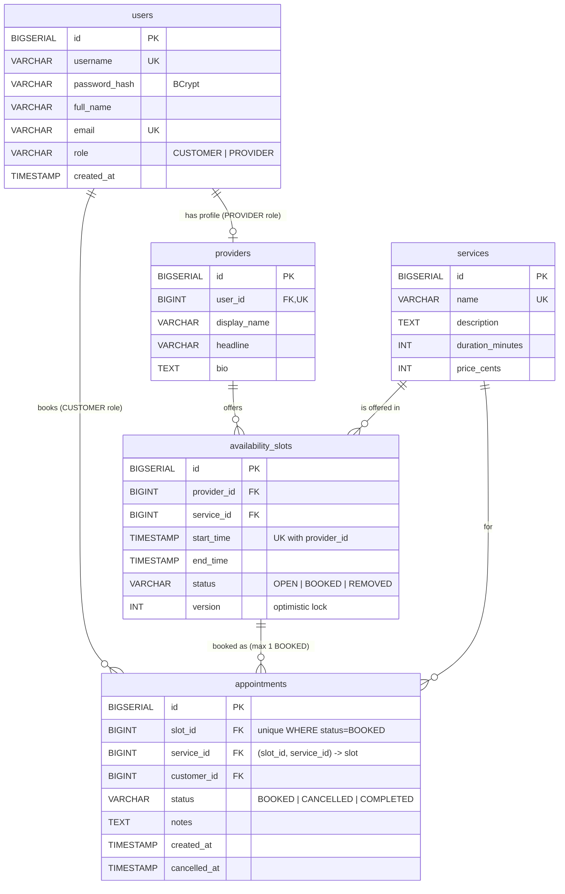

# ER Diagram

Rendered automatically by GitHub (Mermaid). Source of truth: `src/main/resources/schema.sql`.



## Block diagram

```mermaid
flowchart LR
    C[Browser<br/>static index.html / API client] -- HTTP JSON --> A
    subgraph A[Spring Boot app]
        direction TB
        DS[DispatcherServlet<br/>Front Controller] --> CT[Controllers] --> SV[Services<br/>@Transactional] --> RP[Repositories<br/>JdbcClient + SQL]
    end
    RP -- JDBC --> DB[(PostgreSQL)]
    SV -. "commit, then notify (Milestone 3)" .-> N[Mock Notification Service]
```
